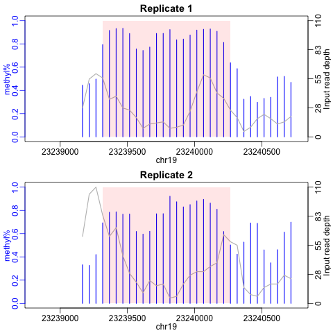

    

```{r setup, include=FALSE}
knitr::opts_chunk$set(echo = TRUE)
```

## Abstract
The post-transcriptional epigenetic modification on mRNA is an emerging field to study the gene regulatory mechanism and their association with diseases. Recently developed high-throughput sequencing technology named Methylated RNA Immunoprecipitation Sequencing (MeRIP-seq) enables one to profile mRNA epigenetic modification transcriptome-wide. A basic task in the analysis of MeRIP-seq data is to identify transcriptome-wide m6A regions (namely "peak calling"). The package TRESS provides methods for peak calling of MeRIP-seq data, based on an empirical Bayesian hierarchical model. The method accounts for various sources of variations in the data through rigorous modeling, and achieves shrinkage estimation by borrowing informations from transcriptome-wide data to stabilize the parameter estimation. This vignette explains the use of the package by introducing typical workflows. TRESS package version: 0.99.0.


## Running TRESS for peak calling
### 1. Installation
From GitHub: 
```{r, eval = FALSE}
install.packages("devtools") # if you have not installed "devtools" package
library(devtools)
install_github("https://github.com/ZhenxingGuo0015/TRESS")
library(TRESS)
```


## 2. Quick start
Here we provide an quick example of how TRESS performs peak calling. In order to call peaks, TRESS requires paired input control and IP BAM files for each replicate: input1.bam \& ip1.bam, input2.bam \& ip2.bam, .... The BAM files contain mapped reads sequenced from respective samples and are the output of sequence alignment tools like Bowtie2. In addition to BAM files, TRESS also needs the genome annotation of reads saved in format of "*.sqlite". Then peak calling is conducted using the following code:


```{r, eval= FALSE}
## Directly take BAM files in "datasetTRES"
library(TRESS)
library(datasetTRES)
IP.file = c("cb_ip_rep1_chr19.bam", "cb_ip_rep2_chr19.bam")
Input.file = c("cb_input_rep1_chr19.bam", "cb_input_rep2_chr19.bam")
BamDir = file.path(system.file(package = "datasetTRES"), "extdata/")
annoDir = file.path(system.file(package = "datasetTRES"),
                    "extdata/mm9_chr19_knownGene.sqlite")
OutDir = "/directory/to/output"
TRESS_peak(IP.file = IP.file,
           Input.file = Input.file,
           Path_To_AnnoSqlite = annoDir,
           InputDir = BamDir,
           OutputDir = OutDir,
           experiment_name = "examplebyBam",
           filetype = "bam")
peaks = read.table(paste0(OutDir, "/", "c"), sep = "\t", header = TRUE)

  # read.table(file.path(system.file(package = "TRESS"),
  #                            "extdata/examplebyBam_peaks.xls"),
  #                  sep = "\t", header = TRUE)
head(peaks)
```
In this example, we use the dataset (only "chr19" from the cerebellum sample of **Young Mouse data**) saved in data package **datasetTRES** (please install it first: install_github("https://github.com/ZhenxingGuo0015/datasetTRES").

To replace the example BAM files with your BAM files, the codes are:


```{r, eval=FALSE}
## or, take BAM files from your path
IP.file = c("ip_rep1.bam", "ip_rep2.bam")
Input.file = c("input_rep1.bam", "input_rep2.bam")
BamDir = "/directory/to/BAMfile"
annoDir = "/path/to/xxx.sqlite"
OutDir = "/directory/to/output"
TRESS_peak(IP.file = IP.file,
           Input.file = Input.file,
           Path_To_AnnoSqlite = annoDir,
           InputDir = BamDir,
           OutputDir = OutDir,
           experiment_name = "example",
           filetype = "bam")
peaks = read.table(paste0(OutDir, "/", "example_peaks.xls"), sep = "\t", header = TRUE)
head(peaks)
```


## 3.Details of peak calling in TRESS
### 3.1 BAM file
TRESS starts with paired input and IP BAM files from each replicate. 
The input and IP BAM files are taken separately by arguments "Input.file" and "IP.file" in the same order, i.e., input1.bam, input2.bam, ... for "Input.file"; ip1.bam, ip2.bam, .... for "IP.file."

### 3.2 TXDB Annotation file
In addition to BAM files, TRESS also needs a path to an annotation file in order to obtain transcriptome wide bins, bin-level read counts and annotation of each peak. The annotation file is actually is a TXDB and is saved in format of "*.sqlite". Here, we show an example of how to create such a file:

```{r, eval=TRUE, message=FALSE, warning=FALSE}
## Directly use "makeTxDbFromUCSC" function to create one
library(GenomicFeatures)
txdb = makeTxDbFromUCSC("mm9", "knownGene")
#saveDb(txdb, file = paste0("YourPATH", "/", "YourGenome.sqlite")

##  or load a TxDb annotation package like
#library(TxDb.Mmusculus.UCSC.mm9.knownGene)
#txdb <- TxDb.Mmusculus.UCSC.mm9.knownGene
#saveDb(txdb, file = paste0("YourPATH", "/", "mm9_knownGene.sqlite")
```

### 3.3 Two-step approach of peak calling with multiple replicates

### 3.3.1 Bin-level read counts and bump finding
Given the TXDB file, TRESS first divide each gene into 50bp long bins and calculate the bin-level read counts. Then, binomial test is conducted for each bin to obtain their statistical significance. An ad hoc bump-finding algorithm is applied to combine significant bins (and/or bins with large fold change) to form bumps in each replicate. Bumps from all replicates are combined together to construct a list of candidate regions. Both binomial tests and bump-finding are done by function "M6Apeak.MultiRep.step1()" in TRESS. Here is an example of how to run "M6Apeak.MultiRep.step1()", given bin-level read counts from 7 mouse basal cortex replicates.

```{r,eval=TRUE, message=FALSE, warning=FALSE}
library(TRESS)
## load in built-in bin-level read counts 
data("Basal_binlevel") ### The first 14 columns are from basal samples of mouse cortex
sf0 = colSums(Basal_binlevel$bincounts)/median(colSums(Basal_binlevel$bincounts))
### first step to call candidate regions
Candidates = M6Apeak.MultiRep.step1(Counts = Basal_binlevel$bincounts[,
grepl("basal",colnames(Basal_binlevel$bincounts))],
                                    bins = Basal_binlevel$bins,
                                    sf = sf0[grepl("basal",names(sf0))],
                                    WhichThreshold = "lfc",
                                    lfc.cutoff = 0.5)
```

### 3.3.2 Detect and rank significant regions from candidates
After obtaining candidate regions, TRESS models read counts in candidate regions using a hierarchical negative-binomial model. Wald tests are then conducted to detects significant regions from candidates, where a region with methylation level significantly higher than the background is considered as sigificant. The background level is estimated based on total read counts from non-candidate regions, which is calculated as follows:

```{r, eval=TRUE}
### estimate background methylation level
idx = which(grepl("rep", colnames(Candidates)) | 
              grepl("bam", colnames(Candidates)))
PeakCount = Candidates[, idx]
bgCount = colSums(Basal_binlevel$bincounts[, grepl("basal",colnames(Basal_binlevel$bincounts))]) - colSums(PeakCount)
bg.Input = bgCount[seq(1, length(bgCount), 2)]
bg.IP = bgCount[seq(2, length(bgCount), 2)]
bg.mu = mean((bg.IP/sf0[seq(2, length(bgCount), 2)])/(bg.IP/sf0[seq(2, 
                                                                    length(bgCount), 2)] + bg.Input/sf0[seq(1, length(bgCount),                                                                                                            2)]), na.rm = TRUE)
```

Complete parameter estimation and statistical inference for candidate regions are achieved by function "M6Apeak.MultiRep.step2()" in TRESS.
```{r, eval = TRUE, message=FALSE, warning=FALSE}
Peaks = M6Apeak.MultiRep.step2(Candidates = Candidates, 
                               mu.cutoff = bg.mu,
                               sf =sf0[grepl("basal",names(sf0))])

head(Peaks)
```

Given the usage of function "M6Apeak.MultiRep.step2()", it can also be adopted to re-rank existing peaks with our developed methods. This may perform bad if you didn't properly estimate library size factors for each sample. Based on our experience, the estimation of size factor should be based on the bin-level counts across the whole transcriptome, not the  region-level counts. For background methylation level, you can use 0.5 but it would be informative if you can estimate it from your data. The following chunk of codes shows an example for re-ranking existing peaks with function "M6Apeak.MultiRep.step2()".

```{r, eval=FALSE, message= TRUE, warning= FALSE}
library(TRESS)
data("Basal_regionlevel") ### load candidate regions
data("Basal_binlevel") ### load sf0 estimated from bin-level count
head(Basal_regionlevel)
peaks = M6Apeak.MultiRep.step2(Candidates = Basal_regionlevel,
                               sf = Basal_binlevel$sf, 
                               mu.cutoff = 0.5,
                               WhichThreshold = "fdr")
head(peaks)
```

## 3.4 Peak calling with only one replicate
The above two-step approach is for data with multiple replicates. For data with only one replicate, TRESS uses function "M6Apeak.oneRep()" for peak calling. In this case, bumps from the first step in above two-step procedure are taken as final list of peaks. The statistical significance of each peak comes from binomial tests. Here we show an example of how to use function "M6Apeak.oneRep()".

```{r, eval = TRUE, message= FALSE, warning= FALSE}
# A toy example
library(TRESS)
data("Basal_binlevel")
bincounts = Basal_binlevel$bincounts[, 1:2]
sf0 = Basal_binlevel$sf[1:2]
bins = Basal_binlevel$bins
peaks = M6Apeak.oneRep(Counts = bincounts, sf = sf0, bins = bins)
head(peaks)
```


### 3.5 Visualization of individual peaks
With pre-called peaks in hand, one can visualize them using function "ShowOnePeak()" in TRESS. The usage of this function is
```{r, eval=FALSE, message= FALSE, warning= FALSE}
ShowOnePeak(onePeak, allBins, binCounts, ext = 500, ylim = c(0,1))
```
In order to run this function, you need to have: 1) "onePeak": a pre-called peak saved as a dataframe, which contains genomic positions for that peak: "chr", "start", "end", "strand"; 2) "allBins": genomic positions ("chr", "start", "end", "strand") of all bins you used to call peaks; 3) "binCounts": the corresponding bin-level read counts in each replicate. This function will plot for each replicate: the methylation level of bins (blue bars) within the target peak(shade region in pink), and the normalized sequencing depth for input samples (curves in grey).
We show some example plots here:

```{r, eval=FALSE, message= FALSE, warning= FALSE}
# library(datasetTRES)
# IP.file = c("cb_ip_rep1_chr19.bam", "cb_ip_rep2_chr19.bam")
# Input.file = c("cb_input_rep1_chr19.bam", "cb_input_rep2_chr19.bam")
# BamDir = file.path(system.file(package = "datasetTRES"), "extdata/")
# annoDir = file.path(system.file(package = "datasetTRES"), "extdata/mm9_chr19_knownGene.sqlite")
# OutDir = getwd() #YourOutputDir
# TRESS_peak(IP.file = IP.file,
#           Input.file = Input.file,
#           Path_To_AnnoSqlite = annoDir,
#           InputDir = BamDir,
#           OutputDir = OutDir,
#           experiment_name = "examplebyBam",
#           filetype = "bam")

# peaks = read.table(paste0(OutDir, "/", "examplebyBam_peaks.xls"), sep = "\t", header = TRUE)
# load(paste0(OutDir, "/", "examplebyBam.rda"))
# allBins = as.data.frame(bins$bins)
# colnames(allBins)[1] = "chr"
# allBins$strand = binStrand

peaks = read.table(file.path(system.file(package = "TRESS"),
                             "extdata/examplebyBam_peaks.xls"),
                   sep = "\t", header = TRUE) 
load(file.path(system.file(package = "TRESS"),
               "extdata/examplebyBam.rda"))
allBins = as.data.frame(bins$bins)
colnames(allBins)[1] = "chr"
allBins$strand = binStrand

head(peaks)
# #for (i in 1:4) {
 #png(file = paste0("ExamplePeaks.png"), bg = "transparent")
   ShowOnePeak(onePeak = peaks[1,], allBins = allBins, binCounts = allCounts)
 #dev.off()
# #}
```

```{r echo=FALSE, out.height = "80%", out.width = "80%", include=TRUE}

```


