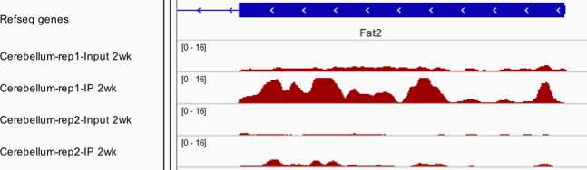

\tableofContents


# Introduction 
## Background
The post-transcriptional epigenetic modification on mRNA is an 
emerging field to study the gene regulatory mechanism and 
their association with diseases. Recently developed 
high-throughput sequencing technology named 
Methylated RNA Immunoprecipitation Sequencing (MeRIP-seq) 
enables one to profile mRNA epigenetic modification transcriptome-wide. 

In MeRIP-seq, mRNA is first fragmented into approximately 
100-nucleotide-long oligonucleotides, and then 
immunoprecipitated by an anti-m$^6$A affinity purified antibody. 
In addition to the immunoprecipitated (IP) samples, 
libraries are also prepared for input control 
fragments to measure the corresponding reference mRNA abundance. 
This process is an RNA-seq experiment.
After sequencing, the reads from both the IP and the input 
samples are aligned to the reference genome. 
Due to the enrichment from IP process, 
transcriptomic regions with m$^6$A will 
have more reads clustered and have peak-like shapes 
when visualizing the read counts along the genome. 
Therefore, people often refer the m$^6$A regions as "peaks", 
which is a term usually used in ChIP-seq to represent the 
protein binding sites. Figure \@ref(fig:m6aPeak) shows some example 
peaks on the Fat2 gene from a dataset to study m$^6$A dynamics 
during mouse brain development, where m$^6$A in cerebellums 
from 2-week old mice are profiled with two biological replicates. 

```{r m6aPeak, echo=FALSE, out.height = "80%", out.width = "80%", include=TRUE,fig.cap="Peaks from MeRIP-seq in a mouse brain study"}

```

Two major tasks in the analysis of MeRIP-seq data are to 
identify transcriptome-wide m$^6$A methylation (namely "peak calling"), 
and differential m6A methylation. 


For the first problem, TRESS builds a two-step procedure to 
identify transcriptome wide m$^6$A regions. In the first step, 
it quickly scans the whole transcriptome and losely identify 
candidate regions using an ad hoc algorithm. In the second step, 
it models read counts from candidate regions using an 
empirical hierarchical negative binomial model to accounts 
for all-sources variations. It also imposes a prior on 
the dispersion of methylation, which induces a shrinkage 
variance estimate by borrowing information from all 
candidate regions. Wald test is constructed to detect 
significant m$^6$A regions from the candidates. Metthod 
for the second problem is under development and will be 
available soon.


## Installation 
From GitHub: 
```{r, eval = FALSE, warning=FALSE, message=FALSE}
install.packages("devtools") # if you have not installed "devtools" package
library(devtools)
install_github("https://github.com/ZhenxingGuo0015/TRESS", 
               build_vignettes = TRUE)
```
To view the package vignette in HTML format, run the following lines in R
```{r eval=FALSE,warning=FALSE,message=FALSE}
library(TRESS)
vignette("TRESS")
```

# Input data preparation{#section:InputData}
TRESS requires paired 
input control and IP BAM files for each replicate of all samples: 
"input1.bam \& ip1.bam", "input2.bam \& ip2.bam", .... in order to call peaks from all replicates.
The BAM files contain mapped reads sequenced from 
respective samples and are the output of sequence alignment tools 
like ``Bowtie2``. 

For illustration purpose, we include four example BAM files and one corresponding genome annotation file in our publicly available data package ``datasetTRES``on github, 
which can be installed with
```{r, eval= FALSE}
install_github("https://github.com/ZhenxingGuo0015/datasetTRES")
```
The BAM files contain sequencing reads (only on chromosome 19) 
from two input \& IP mouse brain cerebellum samples.

In addition to BAM files, TRESS also needs a path to 
an annotation file in order to obtain transcriptome-wide bins, 
bin-level read counts and annotation of each peak. 
The annotation file is actually is a TXDB and is saved in 
format of ``*.sqlite``, which is easily created using R function 
``makeTxDbFromUCSC()`` from Bioconductor package ``GenomicFeatures``:
```{r, eval=FALSE, message=FALSE, warning=FALSE}
## Directly use "makeTxDbFromUCSC" function to create one
library(GenomicFeatures)
txdb = makeTxDbFromUCSC("mm9", "knownGene")
# saveDb(txdb, file = paste0("YourPATH", "/", "YourGenome.sqlite")

## or load a TxDb annotation package like
# library(TxDb.Mmusculus.UCSC.mm9.knownGene)
# txdb <- TxDb.Mmusculus.UCSC.mm9.knownGene
# saveDb(txdb, file = paste0("YourPATH", "/", "mm9_knownGene.sqlite")
```
If one already has one .gtf file, then a TXDB file can be created using the following code:
```{r, eval=FALSE, message=FALSE, warning=FALSE}
library(GenomicFeatures)
txdb = makeTxDbFromGFF("directory/to/your/xxx.gtf", format = "gtf")
# saveDb(txdb, file = paste0("YourPATH", "/", "YourGenome.sqlite")
```

# Example dataset {#section:EData}
TRESS provides one example MeRIP-seq dataset.
The raw sequencing reads were downloaded 
from GEO, and mapped using ``Bowtie2`` to generate 
corresponding BAM files. 
With BAM files, we apply TRESS to obtain transcriptome 
bins and candidate regions. A small subset of both bin-level 
and region-level data are stored as examples in 
TRESS for package illustration purpose.


The example dataset ``Basal`` comes from 7 basal 
mouse brain samples (GEO accession number GSE113781). 
The total number of bins and candidate regions for 
original data are 1,620,977 and 13,017 respectively.
Due to space limit, 
only data of randomly selected 1000 bins and 
500 regions (bins and regions are not necessarily overlapped) 
are saved. In particular, 
for each bin and candidate region, 
both the genomic coordinate and read counts 
(across 7 paired input \& ip replicates) are kept.
 
```{r loadData,warning=FALSE,message=FALSE}
library(TRESS)
data("Basal")
Bins <- Basal$Bins$Bins
BinCounts <- Basal$Bins$Counts
dim(BinCounts)
Candidates <- Basal$Candidates$Regions
CandidatesCounts <- Basal$Candidates$Counts
sf <- Basal$Bins$sf
```

Check the coordinates of each bin and candidate region. 
```{r BasalBins}
head(Bins, 3) 
head(Candidates, 3)
```

Check the read counts in each bin and candidate region. 
```{r BasalCount}
dim(BinCounts)
head(BinCounts, 3)
dim(CandidatesCounts)
head(CandidatesCounts,3)
```
Check the library size factor of each sample in this data. 
```{r Basalsf}
sf
```


# Detection of transcriptome wide peaks {#section:Peak}
Peak calling in TRESS is performed using one wrapper function 
``TRESS_peak()``. Here we use example BAM files from datasetTRES
as an example.
```{r, eval= FALSE,warning=FALSE, message=FALSE}
## Directly take BAM files in "datasetTRES" available on github
library(datasetTRES)
Input.file = c("cb_input_rep1_chr19.bam", "cb_input_rep2_chr19.bam")
IP.file = c("cb_ip_rep1_chr19.bam", "cb_ip_rep2_chr19.bam")
BamDir = file.path(system.file(package = "datasetTRES"), "extdata/")
annoDir = file.path(system.file(package = "datasetTRES"),
                    "extdata/mm9_chr19_knownGene.sqlite")
OutDir = "/directory/to/output"  
TRESS_peak(IP.file = IP.file,
           Input.file = Input.file,
           Path_To_AnnoSqlite = annoDir,
           InputDir = BamDir,
           OutputDir = OutDir, # specify a directory for output
           experiment_name = "examplebyBam", # name your output 
           filetype = "bam")
```
```{r, eval= TRUE}
### example peaks
peaks = read.table(file.path(system.file(package = "TRESS"),
                           "extdata/examplebyBam_peaks.xls"),
                 sep = "\t", header = TRUE)
head(peaks[, -c(5, 14, 15)], 3)
```

To replace the example BAM files with your BAM files, the codes are:
```{r, eval=FALSE}
## or, take BAM files from your path
Input.file = c("input_rep1.bam", "input_rep2.bam")
IP.file = c("ip_rep1.bam", "ip_rep2.bam")
BamDir = "/directory/to/BAMfile"
annoDir = "/path/to/xxx.sqlite"
OutDir = "/directory/to/output"
TRESS_peak(IP.file = IP.file,
           Input.file = Input.file,
           Path_To_AnnoSqlite = annoDir,
           InputDir = BamDir,
           OutputDir = OutDir,
           experiment_name = "xxx",
           filetype = "bam")
peaks = read.table(paste0(OutDir, "/", 
                          "xxx_peaks.xls"), 
                   sep = "\t", header = TRUE)
head(peaks, 3)
```

As a wrapper function, ``TRESS_peak()`` combines multiple subfunctions to 
detect m6A regions transcriptome-wide. 
 The whole process involves following steps:
 
$\quad 1$. Divide genome into equal sized bins and obtain read counts in each replicate using 
  ``DivideBins()``.
  
$\quad 2$. Call candidate regions based on bin-level data across all replicates using 
   ``CallCandidates()``
   
$\quad 3$. Fit Negative binomial models for read counts in candidate regions to 
detect and rank peaks among all candidates using ``CallPeaks.multiRep()``.


If there is only one replicate, functions in step 2 
and step 3 will be replaced by 
one function ``CallPeaks.oneRep()``, while function ``DivideBins()`` 
will still be used to obtain bin-level data. Please see the man pages for
detailed usage of ``DivideBins()``. Given bin-level data, peak calling 
by sub-functions are included in following 
Section \@ref(section:PeakMultiReps) and Section \@ref(section:PeakOneRep).


## Peak calling with multiple replicates {#section:PeakMultiReps}
### Obtain candidate regions
With bin-level read counts, binomial test is first conducted 
for each bin. Then an ad hoc bump-finding algorithm 
is applied to merge significant bins 
(and/or bins with large fold change) and form bumps in each  
replicate. 
Bumps from all input \& IP replicates are unioned together to 
construct a list of candidate regions. 
Both binomial tests and bump-finding are done by 
function ``CallCandidates()`` in TRESS. 

Here, we use example dataset ``Basal`` introduced in Section \@ref(section:EData) to run ``CallCandidates()``.
```{r,eval=TRUE, message=FALSE, warning=FALSE}
## load in first example dataset
data("Basal") 
Candidates = CallCandidates(
    Counts = Basal$Bins$Counts,
    bins = Basal$Bins$Bins
    )
```


### Call peaks from candidates
After obtaining candidate regions, TRESS models read counts 
in candidate regions using a hierarchical negative-binomial model. 
Wald tests are then conducted to detect significant regions 
from candidates, where a region with methylation level significantly higher than the background is considered as sigificant. 
The background methylation level is estimated based on 
total read counts 
from non-candidate regions, which is calculated as the total 
bin-counts subtracted by counts from candidate regions. 
This can be obtained using function ``BgMethylevel()`` in TRESS.
With background methylation level estimated, 
complete parameter estimation and statistical inference 
for candidate regions are achieved by function 
``CallPeaks.multiRep()`` in TRESS, where argument ``Candidates`` 
is a list containing at least two components: genomic coordinates 
(e.g., "chr", "start" and "end" etc) of all candidate regions 
and their read counts across all samples. 
Here is an example, provided that the background 
methylation level is 0.5,
```{r, eval=TRUE, message= TRUE, warning= FALSE}
data("Basal") ### load candidate regions
Basal$Candidates$sf = Basal$Bins$sf
peaks1 = CallPeaks.multiRep(
  Candidates = Basal$Candidates,
  mu.cutoff = 0.5
  )
head(peaks1, 3)
```
_**A word about CallPeaks.multiRep()**_ 
Different criteria are available in TRESS to filter peaks based on results of Wald tests, including p-values, FDR and 
log fold change (logFC). 
One needs to first specify a criterion through argument  ``WhichThreshold`` and 
then provide a cutoff for that criterion 
through one or two arguments named ``*.cutoff``.
By default, TRESS adopts both FDR and 
logFC (through``WhichThreshold = "fdr_lfc"``) to select peaks. 
The default cutoffs for FDR and logFC are 0.05 and 0.7 
(for fold change of 2) respectively, meaning that peaks 
with FDR < 0.05 and logFC > 0.7 will be kept. 
With ``WhichThreshold = "fdr_lfc"``, one can 
change the cutoffs to more stringent values, 
e.g., FDR < 0.01 and logFC > 1.6 by setting 
``fdr.cutoff = 0.01`` and ``lfc.cutoff = 1.6``: 
```{r, eval=TRUE, message= TRUE, warning= FALSE}
### use different threshold to filter peaks
peaks2 = CallPeaks.multiRep(
  Candidates = Basal$Candidates,
  mu.cutoff = 0.5, 
  fdr.cutoff = 0.01, 
  lfc.cutoff = 1.6  
  )
```

However, one can also set ``WhichThreshold = "fdr"`` to select 
peaks only with FDR, then by default peaks 
with FDR < 0.05 will be kept: 
```{r, eval=TRUE, message= TRUE, warning= FALSE}
### use different threshold to filter peaks
peaks3 = CallPeaks.multiRep(
  Candidates = Basal$Candidates,
  mu.cutoff = 0.5, 
  WhichThreshold = "fdr"
  )
```
Please read the manual page of function ``CallPeaks.multiRep()`` 
for more details on each argument. 

Given the usage of function "CallPeaks.multiRep()", 
it can also be adopted to re-rank existing peaks with our 
developed methods, if their read counts are available. 
This may perform bad if one didn't properly 
estimate library size factor (one argument of ``Candidates``) 
for each sample. 
Based on our experience, the estimation of size factor 
should be based on the bin-level counts across the 
whole transcriptome, not the region-level counts. 
For background methylation level, 
one can use 0.5 but it would be informative if
estimating it from the data.


## Peak calling with one replicate {#section:PeakOneRep}
The above two-step approach is for data with multiple replicates. 
For data with only one replicate, ``TRESS_peak()`` calls function ``CallPeaks.oneRep()`` 
for peak calling given bin-level data. In this case, 
bumps in the only one replicate are taken as final list of peaks. 
The statistical significance of each peak comes from binomial tests. Here is an example of how to run function ``CallPeaks.oneRep()``.
```{r, eval = TRUE, message= FALSE, warning= FALSE}
# A toy example
data("Basal")
bincounts = Basal$Bins$Counts[, 1:2]
sf0 = Basal$Bins$sf[1:2]
bins = Basal$Bins$Bins
peaks = CallPeaks.oneRep(Counts = bincounts, 
                         sf = sf0, bins = bins)
head(peaks, 3)
```


## Peak visualization 
With pre-called peaks in hand, one can visualize them 
using function "ShowOnePeak()" in TRESS. 
The usage of this function is
```{r, eval=FALSE, message= FALSE, warning= FALSE}
ShowOnePeak(onePeak, allBins, binCounts, ext = 500, ylim = c(0,1))
```
In order to run this function, one needs to have: 
1) "onePeak": 
a pre-called peak saved as a dataframe, 
which contains genomic positions for that peak: 
"chr", "start", "end", "strand"; 
2) "allBins": genomic positions ("chr", "start", "end", "strand") 
of bins overlapping at least with the pre-called peak; 
3) "binCounts": the corresponding bin-level 
read counts in each replicate.
This function will plot for each replicate: 
the methylation level of bins (blue bars) within 
the target peak (shade region in pink), 
and the normalized sequencing depth for input samples (curves in grey).
We show some example plots here:

```{r, eval=TRUE, message= FALSE, warning= FALSE}
peaks = read.table(file.path(system.file(package = "TRESS"),
                             "extdata/examplebyBam_peaks.xls"),
                   sep = "\t", header = TRUE) 
load(file.path(system.file(package = "TRESS"),
               "extdata/examplebyBam.rda"))
allBins = as.data.frame(bins$bins)
colnames(allBins)[1] = "chr"
allBins$strand = binStrand

head(peaks, 1)
ShowOnePeak(onePeak = peaks[1,], allBins = allBins, 
            binCounts = allCounts)
```


# Session info {.unnumbered}
```{r sessionInfo, echo=FALSE}
sessionInfo()
```


